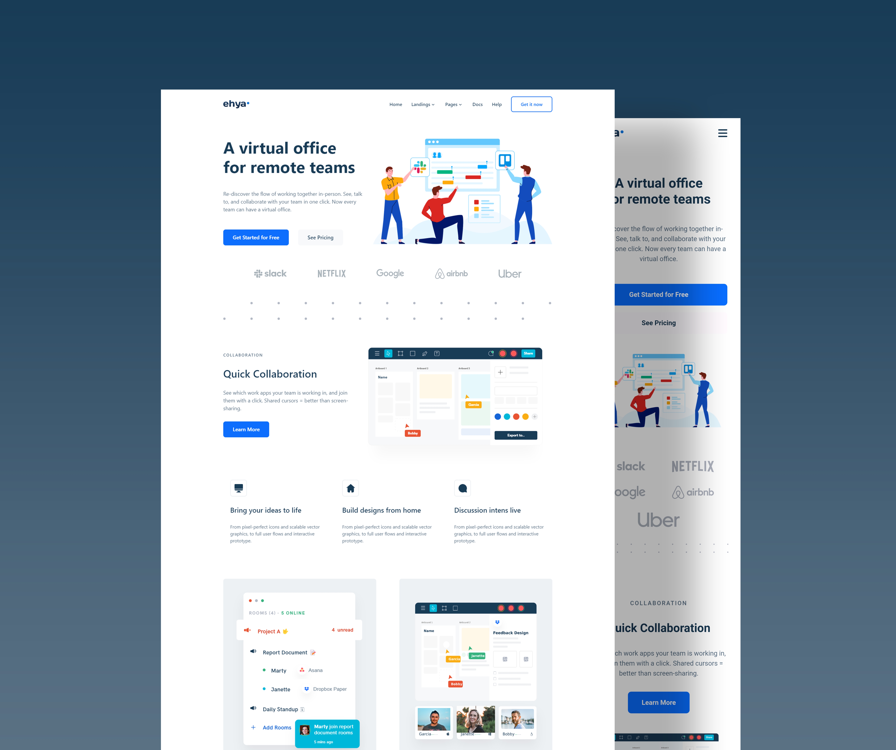

# Ehya - Front-end Assessment Test
> Live demo [_here_](https://oussama-chaoui.github.io/Front-end-landing-page/dist/index.html).

## Table of Contents
* [General Info](#general-information)
* [Technologies Used](#technologies-used)
* [Screenshots](#screenshots)
* [Project Status](#project-status)
* [Room for Improvement](#room-for-improvement)
* [Contact](#contact)

## General Information
This is a Landingn page create with HTML, CSS and JavaScript.
I undertook the project because it is an Assessment test to get a job as a front-end developer

## Technologies Used
- Bootstrap - version 5.1
- Owl Carousel - version 2.3.4
- Webpack - version 5.73.0
- babel-loader - version 8.2.5

## Screenshots

<!-- If you have screenshots you'd like to share, include them here. -->

## Project Status
Project is: _in progress_ / _complete_ / _no longer being worked on_. If you are no longer working on it, provide reasons why.

## Room for Improvement
Include areas you believe need improvement / could be improved. Also add TODOs for future development.

Room for improvement:
- Improvement to be done 1
- Improvement to be done 2

## Contact
Created by [@Oussama Chaoui](https://github.com/Oussama-Chaoui) - feel free to contact me at [my email](oussamaqqqq@gmail.com) !

